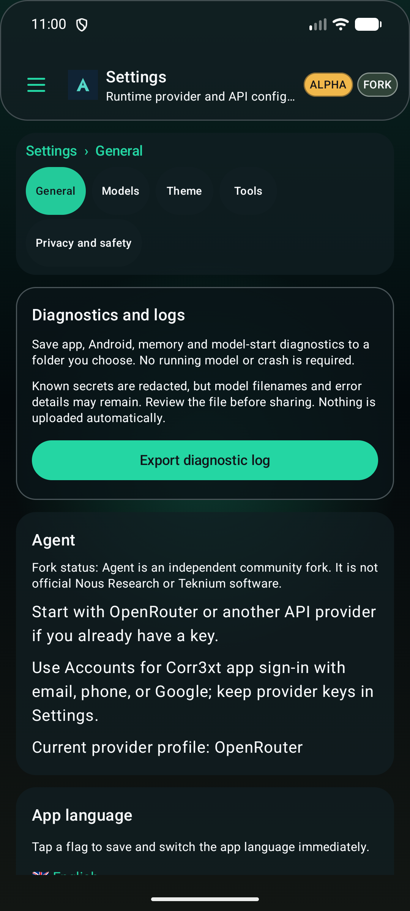
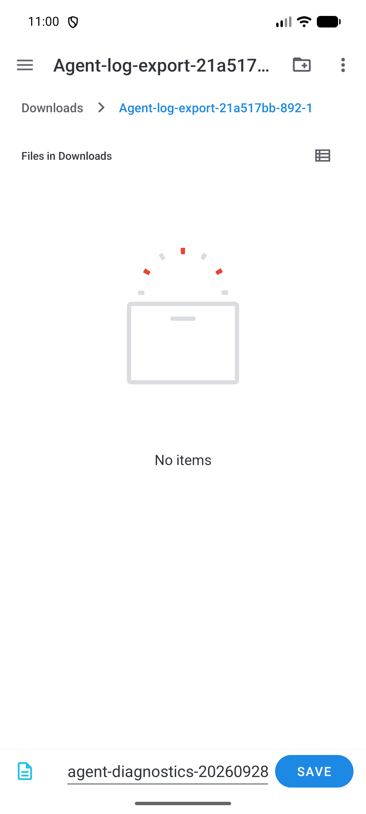
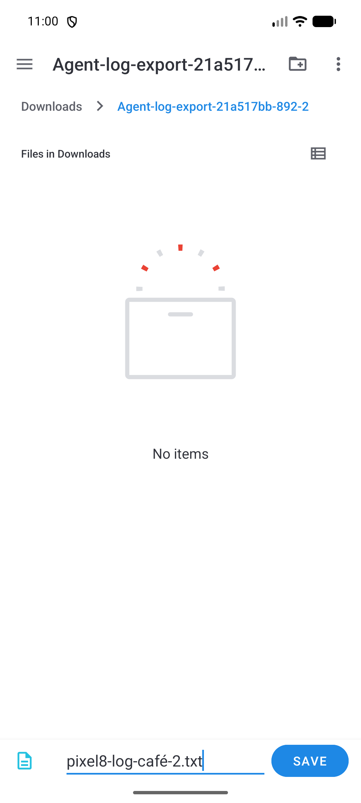
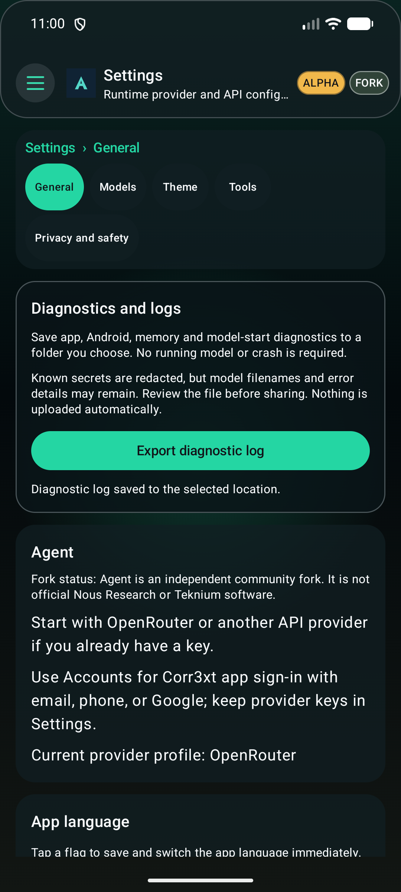

# Issue #24 — visible diagnostic log export

## Delivered

Open **Settings → General → Diagnostics and logs → Export diagnostic log**. The card is the first General section. It is also available in Models immediately after the model picker, outside advanced/runtime disclosures. The existing Device diagnostics page uses the same export control.

The button opens Android’s actual Save dialog. Choose phone storage, navigate to or create a folder, edit the suggested `.txt` filename, then press Save. The app reports success only after UTF-8 writing, flushing and closing the chosen document succeed. No model start, crash, `/debug`, broad storage permission or automatic upload is required.

The report includes app edition/version/build identity, Android build/device details, a fresh system-memory snapshot, the separate last model-start attempt, saved crash information and bounded recent diagnostic events. Known secret patterns are redacted structurally, preserving numeric RAM counters. Model filenames and unrecognized personal error details may remain: review the file before sharing. It does not collect chat history, provider configuration, device-unique IDs or system-wide logcat. Very large historical records are bounded with an explicit omission message; this is not an unbounded forensic dump.

## Actual tests

| Check | Result |
| --- | --- |
| Full JVM suite | 1,060 passed; no failures, errors or skips |
| Play-scoped JVM suite | 30 passed; no failures, errors or skips |
| Installed Full export tests | 2 passed |
| Installed Full settings/accessibility/workspace regressions | 8 passed |
| Installed Play export tests | 2 passed |
| Installed Play settings/accessibility regressions | 6 passed |
| Full / Play lint | Zero errors against the unchanged baseline; 58 / 61 warnings remain |
| Native Full/Play APK builds and package validators | Passed; no native-assets skip |
| Reused F-Droid candidate | Passed with scanning and strict source binding; unsigned, unpublished, warm-cache scope |

Both editions were opened through their **real manifest launcher**, not a replacement screen. Each used Android DocumentsUI to create two different user-chosen folders, save custom accented filenames, and rotate while the external picker was open. Each actual file was independently read again after both saves, then checked for the complete end marker, expected fields, unchanged numeric counters, secret redaction, byte count and SHA-256. Four distinct saved documents passed. The old files were not overwritten.

Cancellation was accepted only after the picker returned to the app; merely navigating back a folder or dismissing the keyboard was not counted. The error/retry UI was tested using an injected denied-provider result; successful saves used the actual Android picker, not an intercepted success intent. Direct stream tests separately verified null/open/write/flush/close failures, UTF-8, size limits and ownership of stream closure. Saved-state tests cover cancellation, duplicate admission and interrupted-operation recovery; installed tests cover activity recreation and real picker rotation. Six-language text and 320-dp/large-text access remain covered.

The diagnostic fixture intentionally records a synthetic failed preflight and fake credentials so that redaction and preserved numeric fields can be asserted. **It is not a reproduction of the Pixel 8 memory failure.** The reporter’s exact variant is `gemma-4-E2B-it-UD-IQ3_XXS.gguf`, not the earlier Q3_K_M model. Issue #24 remains open for that device-specific cause.

## Exact source and artifact identity

Application and JVM/lint source: `e1b64cd910c509202562b94e1f5b6a278b87bbc9`. Native picker test and F-Droid candidate source: `3fa1ff7a487c7ddb85feb92d1c0a3354a9e23b24`. The intervening changes affect only instrumentation, and both installed application APKs match the exact unit-qualified APK bytes.

The developer Full and Play APKs retain the repository’s tag-less **0.13.146 / 144690** debug identity and `hermes-source-unbound` marker. Their external source/hash records provide test provenance; they are **not** being called a signed v159 release or an in-place update to public v158. Full and Play share the package ID. Use a backed-up separate test installation/profile, and do not remove production data simply to bypass a signing mismatch. No signing credentials, public tag, release or central F-Droid metadata were changed.

[Structured results and exact hashes](summary.json), [unit-suite ledger](unit-suite-ledger.json), [Full native export](full/result.json), [Play native export](play/result.json), [Full regressions](full-regressions.json), [Play regressions](play-regressions.json), [APK payload verification](Full-package-verified.json), [Play binary verification](Play-package-verified.json), [F-Droid result](fdroid-accepted.json), and [raw artifact hashes](raw-artifact-manifest.json) are retained. Published log copies normalize line endings/trailing spaces only; raw originals remain unchanged. The adjacent `synthetic-saved-*.txt` files are the actual verified sample exports, explicitly using test data.

## Visible UI and chosen document

## Failed attempts and environment boundaries

Earlier native failures involved the compact launcher tag, Android17’s direct New folder action, a duplicate/non-clickable Downloads label, stale accessibility drawer state, remembered last-save folders, rotation rebuilding the filename field and Back navigating within the picker. These failures were retained and corrected in the test driver without disabling real-file byte/hash assertions. The first completed file existed before the second-folder navigation was corrected; that partial run was not counted as a full pass. The initial isolated Compose unit fixture also needed its real lifecycle-aware export ViewModel. No app assertion or storage restriction was weakened to manufacture success.

All checks reused the existing Linux builder, dependency caches and Android17 x86_64 AVD. No new container, volume, virtualenv or AVD was created. The Full test app was restored after Play checks without clearing data; the owned emulator and private USB-disabled ADB were retired, the original scheduled task was restored, and models/unrelated files were retained. Physical Pixel8 testing was not performed. New hosted CI has its own result and is not inferred from these local passes.

Android’s documented mechanism: [Storage Access Framework / create a document](https://developer.android.com/training/data-storage/shared/documents-files), [ContentResolver write contract](https://developer.android.com/reference/android/content/ContentResolver#openOutputStream(android.net.Uri,java.lang.String)).
